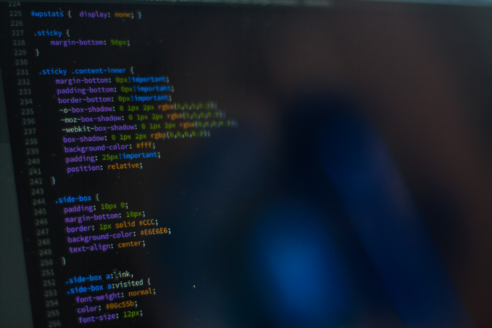

Lately I've been thinking about the way I ended up in the IT field and I thought I'd share it with you 😀

Well at first back in 2016 I used to do some script kiddies tasks like trying to penetrate sql injections with some pre-made app or run some dos attacks ect..

Once I was in my brother's house doing the same stuff I'm used to do till I he caught me doing it lol, I had to explain so I admited that I'm doing this things for a while, what I didn't expect is his reaction he simply advised against it by joking and gave me a CD 💿 containing the full visual studio 2008 installation media and asked me to make apps for learning purposes.

And Yep as you might guess, my first app wasn't just a "Hello World" in a console window, it was a fully functionning text editor that can copy, paste, cut, save and even pronounce what you typed using VB.NET.

I loved it and I kept on doing the same, building things but the sense of destroying is still there I sometimes build and destory what I built just for the sake of learning and having fun ♥
